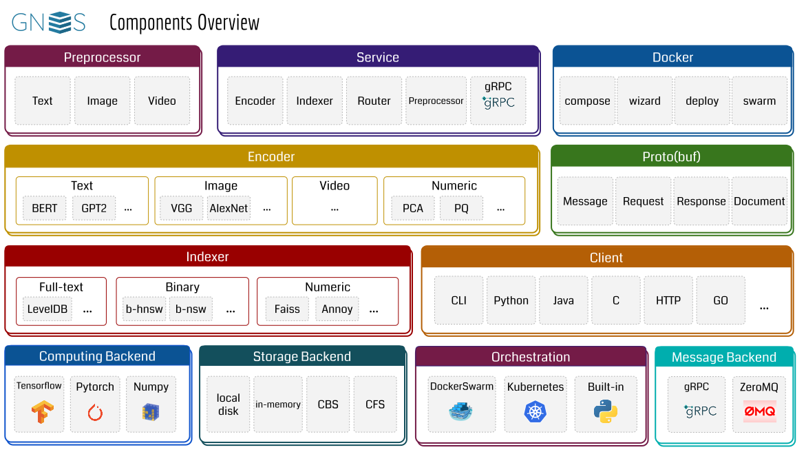
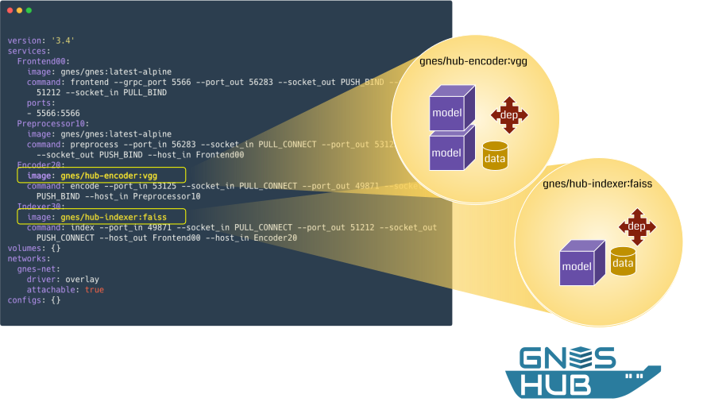

<p align="center">
<a href="https://gnes.ai">
    
</a>
</p>

<p align="center">
<a href="https://cloud.drone.io/gnes-ai/gnes">
    
</a>
<a href="https://pypi.org/project/gnes/">
    
</a>
<a href='https://doc.gnes.ai/'>
    
</a>
<a href="https://www.codacy.com/app/gnes-ai/gnes?utm_source=github.com&amp;utm_medium=referral&amp;utm_content=gnes-ai/gnes&amp;utm_campaign=Badge_Grade">
    
</a>
<a href="https://codecov.io/gh/gnes-ai/gnes">
  
</a>
<a href='https://github.com/gnes-ai/gnes/blob/master/LICENSE'>
    
</a>
</p>

<p align="center">
  <a href="#highlights">Highlights</a> •
  <a href="#overview">Overview</a> •
  <a href="#install-gnes">Install</a> •
  <a href="#getting-started">Getting Started</a> •
  <a href="https://github.com/gnes-ai/hub">Hub</a> •
  <a href="#documentation">Documentation</a> •
  <a href="#tutorial">Tutorial</a> •
  <a href="#contributing">Contributing</a> •
  <a href="./CHANGELOG.md">Release Notes</a> •
  <a href="https://hanxiao.github.io/2019/07/29/Generic-Neural-Elastic-Search-From-bert-as-service-and-Go-Way-Beyond/">Blog</a>  
</p>

<h2 align="center">What is it</h2>

GNES [<i>jee-nes</i>] is **Generic Neural Elastic Search**, a cloud-native semantic search system based on deep neural network. 


GNES enables large-scale index and semantic search for **text-to-text**, **image-to-image**, **video-to-video** and *any-to-any* content form.


<h2 align="center">Highlights</h2>

<p align="center">
  <a href="https://hanxiao.github.io/2019/07/29/Generic-Neural-Elastic-Search-From-bert-as-service-and-Go-Way-Beyond/">💭 To know more about the key tenets of GNES, read this blog post</a>
</p>

<center>
<table>
  <tr>
    <th><h3>☁️</h3><h3>Cloud-Native & Elastic</h3></th>
    <th><h3>🐣</h3><h3>Easy-to-Use</h3></th>
    <th><h3>🔬</h3><h3>State-of-the-Art</h3></th>
  </tr>
  <tr>
    <td width="33%"><sub>GNES is <i>all-in-microservice</i>! Encoder, indexer, preprocessor and router are all running in their own containers. They communicate via versioned APIs and collaborate under the orchestration of Docker Swarm/Kubernetes etc. Scaling, load-balancing, automated recovering, they come off-the-shelf in GNES.</sub></td>
    <td width="33%"><sub>How long would it take to deploy a change that involves just switching a layer in VGG? In GNES, this is just one line change in a YAML file. We abstract the encoding and indexing logic to a YAML config, so that you can change or stack encoders and indexers without even touching the codebase.</sub></td>
    <td width="33%"><sub>Taking advantage of fast-evolving AI/ML/NLP/CV communities, we learn from best-of-breed deep learning models and plug them into GNES, making sure you always enjoy the state-of-the-art performance.</sub></td>
  </tr>
  <tr>
      <th><h3>🌌</h3><h3>Generic & Universal</h3></th>
      <th><h3>📦</h3><h3>Model as Plugin</h3></th>
      <th><h3>💯</h3><h3>Best Practice</h3></th>
    </tr>
    <tr>
      <td width="33%"><sub>Searching for texts, image or even short-videos? Using Python/C/Java/Go/HTTP as the client? Doesn't matter which content form you have or which language do you use, GNES can handle them all. </sub></td>
      <td width="33%"><sub>When built-in models do not meet your requirments, simply build your own with <a href="https://github.com/gnes-ai/hub">GNES Hub</a>. Pack your model as a docker container and use it as a plugin.</sub></td>
      <td width="33%"><sub>We love to learn the best practice from the community, helping our GNES to achieve the next level of availability, resiliency, performance, and durability. If you have any ideas or suggestions, feel free to contribute.</sub></td>
    </tr>
</table>
</center>

<h2 align="center">Overview</h2>
<p align="center">
<a href="https://gnes.ai">

</a>
</p>

### GNES Hub

<center>
<table>
  <tr>
  <td width="33%"><a href="https://github.com/gnes-ai/hub">
      
      </a></td>
  <td>
  <p><a href="https://github.com/gnes-ai/hub">GNES Hub</a> ship AI/ML models as Docker containers and use Docker containers as plugins. It offers a clean and sustainable way to port external algorithms (with the dependencies) into the GNES framework. </p>
  <p>GNES Hub is hosted on the Docker Hub.</p>
</td>
  </tr>
</table>
</center>


<h2 align="center">Install GNES</h2>

There are two ways to get GNES, either as a Docker image or as a PyPi package. **For cloud users, we highly recommend using GNES via Docker**. 

### Run GNES as a Docker Container

```bash
docker run gnes/gnes:latest-alpine
```

This command downloads the latest GNES image (based on [Alpine Linux](https://alpinelinux.org/)) and runs it in a container. When the container runs, it prints an informational message and exits.

#### 💡 Choose the right GNES image

Besides the `alpine` image optimized for the space, we also provide Buster (Debian 10.0), Ubuntu 18.04 and Ubuntu 16.04-based images. The table below summarizes [all available GNES tags](https://cloud.docker.com/u/gnes/repository/docker/gnes/gnes). One can fill in `{ver}` with `latest`, `stable` or `v0..xx`. `latest` refers to the **latest master** of this repository, which [may not be stable](./CONTRIBUTING.md#Merging-Process). We recommend you to use an official release by changing the `latest` to a version number, say `v0.0.24`, or simply using `stable` for the last release, e.g. `gnes:stable-ubuntu`

<table>
  <tr>
    <th>Tag</th>
    <th>Size and layers</th>
    <th>Description</th>
  </tr>
  <tr>
    <td><code>{ver}-alpine</code></td>
    <td><a href="https://microbadger.com/images/gnes/gnes:latest-alpine" title="Get your own image badge on microbadger.com"></a></td>
    <td>based on Alpine Linux;<br>no deep learning libraries;<br>extremely lightweight and portable, enables fast scaling on even edge devices.</td>
  </tr>
  <tr>
    <td><code>{ver}-buster</code></td>
    <td><a href="https://microbadger.com/images/gnes/gnes:latest-buster" title="Get your own image badge on microbadger.com"></a></td>
    <td>based on Debian 10.0;<br>no deep learning libraries;<br>recommended for building or extending a GNES-Hub image.</td>
  </tr>
  <tr>
    <td><code>{ver}-ubuntu18</code></td>
    <td><a href="https://microbadger.com/images/gnes/gnes:latest-ubuntu18" title="Get your own image badge on microbadger.com"></a></td>
    <td>based on Ubuntu 18.04;<br>no deep learning libraries.</td>
  </tr>
  <tr>
    <td><code>{ver}-full</code></td>
    <td><a href="https://microbadger.com/images/gnes/gnes:latest-full" title="Get your own image badge on microbadger.com"></a></td>
    <td>based on Ubuntu 16.04;<br>python-3.6.8, cuda-10.0, tf1.14, pytorch1.1, faiss, multiple pretrained models; <br>heavy but self-contained, useful in testing GNES end-to-endly.</td>
  </tr>
</table>

We also provide a public mirror hosted on Tencent Cloud, from which Chinese mainland users can pull the image faster.

```bash
docker login --username=xxx ccr.ccs.tencentyun.com  # login to Tencent Cloud so that we can pull from it
docker run ccr.ccs.tencentyun.com/gnes/gnes:latest-alpine
```

The table below shows the status of the build pipeline.

<table>
<tr><th>Registry</th><th>Build status</th></tr>
<tr>
<td><sub>Docker Hub</sub><br><code>gnes/gnes:[tag]</code></td>
<td><a href="https://drone.gnes.ai/gnes-ai/gnes"></a></td>
</tr>
<tr>
<td><sub>Tencent Cloud</sub><br><code>ccr.ccs.tencentyun.com/gnes/gnes:[tag]</code></td>
<td><a href="http://193.112.63.208/gnes-ai/gnes"></a></td>
</tr>
</table>

### Install GNES via `pip`

You can also install GNES as a *Python3* package via:
```bash
pip install gnes
```

Note that this will only install a "barebone" version of GNES, consists of **the minimal dependencies** for running GNES. No third-party pretrained models, deep learning/NLP/CV packages will be installed. We make this setup as the default installation behavior, as a model interested to NLP engineers may not be interested to CV engineers. In GNES, models serve as Docker plugins. 

> 🚸 Tensorflow, Pytorch and torchvision are not part of GNES installation. Depending on your model, you may have to install them in advance.

Though not recommended, you can install GNES with full dependencies via:
```bash
pip install gnes[all]
```

<details>
 <summary>🍒 Or cherry-picking the dependencies according to the table below: (click to expand...)</summary>


<table>
<tr><td><pre>pip install gnes[bert]</pre></td><td>bert-serving-server>=1.8.6, bert-serving-client>=1.8.6</td>
<tr><td><pre>pip install gnes[flair]</pre></td><td>flair>=0.4.1</td>
<tr><td><pre>pip install gnes[annoy]</pre></td><td>annoy==1.15.2</td>
<tr><td><pre>pip install gnes[chinese]</pre></td><td>jieba</td>
<tr><td><pre>pip install gnes[vision]</pre></td><td>opencv-python>=4.0.0, imagehash>=4.0</td>
<tr><td><pre>pip install gnes[leveldb]</pre></td><td>plyvel>=1.0.5</td>
<tr><td><pre>pip install gnes[test]</pre></td><td>pylint, memory_profiler>=0.55.0, psutil>=5.6.1, gputil>=1.4.0</td>
<tr><td><pre>pip install gnes[transformers]</pre></td><td>pytorch-transformers</td>
<tr><td><pre>pip install gnes[onnx]</pre></td><td>onnxruntime</td>
<tr><td><pre>pip install gnes[audio]</pre></td><td>librosa>=0.7.0</td>
<tr><td><pre>pip install gnes[scipy]</pre></td><td>scipy</td>
<tr><td><pre>pip install gnes[nlp]</pre></td><td>bert-serving-server>=1.8.6, pytorch-transformers, flair>=0.4.1, bert-serving-client>=1.8.6</td>
<tr><td><pre>pip install gnes[cn_nlp]</pre></td><td>pytorch-transformers, bert-serving-client>=1.8.6, bert-serving-server>=1.8.6, jieba, flair>=0.4.1</td>
<tr><td><pre>pip install gnes[all]</pre></td><td>pylint, psutil>=5.6.1, pytorch-transformers, annoy==1.15.2, bert-serving-client>=1.8.6, gputil>=1.4.0, bert-serving-server>=1.8.6, imagehash>=4.0, onnxruntime, memory_profiler>=0.55.0, jieba, flair>=0.4.1, librosa>=0.7.0, scipy, plyvel>=1.0.5, opencv-python>=4.0.0</td>
</table>
</details> 

A good way to cherry-pick dependencies is following [the example in GNES Hub](https://github.com/gnes-ai/hub#cherry-picking-dependencies-to-enable-gnes-built-in-models) and building you own GNES image.

Either way, if you end up reading the following message after `$ gnes` or `$ docker run gnes/gnes`, then you are ready to go!

<p align="center">
<a href="https://gnes.ai">

</a>
</p>


<h2 align="center">Getting Started</h2>

- [🐣 Preliminaries](#-preliminaries)
  * [Microservice](#microservice)
  * [Runtime](#runtime)
- [Demo for the impatient](#demo-for-the-impatient)
  * [Semantic poem search in 3-minutes or less](#building-a-semantic-poem-search-engine-in-3-minutes-or-less)
- [Build your first GNES app on local machine](#build-your-first-gnes-app-on-local-machine)
- [Scale your GNES app to the cloud](#scale-your-gnes-app-to-the-cloud)
- [Customize GNES on your need](#customize-gnes-to-your-need)
- [Take-home messages](#take-home-messages)
  * [👨‍💻️What's next?](#-whats-next)

### 🐣 Preliminaries

Before we start, let me first introduce two important concepts serving as the backbone of GNES: **microservice** and **runtime**. 

#### Microservice

For machine learning engineers and data scientists who are not familiar with the concept of *cloud-native* and *microservice*, one can picture a microservice as an app (on your smartphone). Each app runs independently, and an app may cooperate with other apps to accomplish a task. In GNES, we have four fundamental apps, aka. microservices, they are:

- [**Preprocessor**](http://doc.gnes.ai/en/latest/chapter/microservice.html#preprocess): transforming a real-world object to a list of workable semantic units;
- [**Encoder**](http://doc.gnes.ai/en/latest/chapter/microservice.html#encode): representing a semantic unit with vector representation;
- [**Indexer**](http://doc.gnes.ai/en/latest/chapter/microservice.html#index): storing the vectors into memory/disk that allows fast-access;
- [**Router**](http://doc.gnes.ai/en/latest/chapter/microservice.html#route): forwarding messages between microservices: e.g. batching, mapping, reducing.

In GNES, we have implemented dozens of preprocessor, encoder, indexer to process different content forms, such as image, text, video. It is also super easy to plug in your own implementation, which we shall see an example in the sequel.

#### Runtime

Okay, now that we have a bunch of apps, what are we expecting them to do? In a typical search system, there are two fundamental tasks: **indexing** and **querying**. Indexing is storing the documents, querying is searching the documents, pretty straightforward. In a neural search system, one may also face another task: **training**, where one fine-tunes an encoder/preprocessor according to the data distribution in order to achieve better search relevance. These three tasks: indexing, querying and training are what we call three **runtimes** in GNES.

💡 The key to understand GNES is to know *which runtime requires what microservices, and each microservice does what*.

### Demo for the impatient

#### Building a semantic poem search engine in 3-minutes or less

For the impatient, we present a complete demo using GNES that enables semantic index and query on poems.

Please checkout [this repository for details](https://github.com/gnes-ai/demo-poems-ir) and follow the instructions to reproduce.

<p align="center">
<a href="https://github.com/gnes-ai/demo-poems-ir">

</a>
</p>

### Build your first GNES app on local machine

Let's start with a typical indexing procedure by writing a YAML config (see the left column of the table):

<table>
<tr>
<th>YAML config</th><th>GNES workflow (generated by <a href="https://board.gnes.ai">GNES board</a>)</th>
</tr>
<tr>
<td width="30%">
   <pre lang="yaml">
port: 5566
services:
- name: Preprocessor
 yaml_path: text-prep.yml
- name: Encoder
 yaml_path: gpt2.yml
- name: Indexer
 yaml_path: b-indexer.yml
   </pre>
</td>
<td width="70%">
  
</td>
</tr>
</table>

Now let's see what the YAML config says. First impression, it is pretty intuitive. It defines a pipeline workflow consists of preprocessing, encoding and indexing, where the output of the former component is the input of the next. This pipeline is a typical workflow of *index* or *query* runtime. Under each component, we also associate it with a YAML config specifying how it should work. Right now they are not important for understanding the big picture, nonetheless curious readers can checkout how each YAML looks like by expanding the items below.

<details>
 <summary>Preprocessor config: text-prep.yml (click to expand...)</summary>
 
```yaml
!SentSplitPreprocessor
parameters:
  start_doc_id: 0
  random_doc_id: True
  deliminator: "[.!?]+"
gnes_config:
  is_trained: true
```
</details>

<details>
 <summary>Encoder config: gpt2.yml (click to expand...)</summary>
 
```yaml
!PipelineEncoder
components:
  - !GPT2Encoder
    parameters:
      model_dir: $GPT2_CI_MODEL
      pooling_stragy: REDUCE_MEAN
    gnes_config:
      is_trained: true
  - !PCALocalEncoder
    parameters:
      output_dim: 32
      num_locals: 8
    gnes_config:
      batch_size: 2048
  - !PQEncoder
    parameters:
      cluster_per_byte: 8
      num_bytes: 8
gnes_config:
  work_dir: ./
  name: gpt2bin-pipe
```

</details>

<details>
 <summary>Indexer config: b-indexer.yml (click to expand...)</summary>
 
```yaml
!BIndexer
parameters:
  num_bytes: 8
  data_path: /out_data/idx.binary
gnes_config:
  work_dir: ./
  name: bindexer
```
</details> 

On the right side of the above table, you can see how the actual data flow looks like. There is an additional component `gRPCFrontend` automatically added to the workflow, it allows you to feed the data and fetch the result via gRPC protocol through port `5566`.

Now it's time to run! [GNES board](https://board.gnes.ai) can automatically generate a starting script/config based on the YAML config you give, saving troubles of writing them on your own. 

<p align="center">
<a href="https://gnes.ai">
    
</a>
</p>

> 💡 You can also start a GNES board locally. Simply run `docker run -d -p 0.0.0.0:80:8080/tcp gnes/gnes compose --serve`

As a cloud-native application, GNES requires an **orchestration engine** to coordinate all micro-services. We support Kubernetes, Docker Swarm and shell-based multi-process. Let's see what the generated script looks like in this case.

<details>
 <summary>Shell-based starting script (click to expand...)</summary>
 
```bash
#!/usr/bin/env bash
set -e

trap 'kill $(jobs -p)' EXIT

printf "starting service gRPCFrontend with 0 replicas...\n"
gnes frontend --grpc_port 5566 --port_out 49668 --socket_out PUSH_BIND --port_in 60654 --socket_in PULL_CONNECT  &
printf "starting service Preprocessor with 0 replicas...\n"
gnes preprocess --yaml_path text-prep.yml --port_in 49668 --socket_in PULL_CONNECT --port_out 61911 --socket_out PUSH_BIND  &
printf "starting service Encoder with 0 replicas...\n"
gnes encode --yaml_path gpt2.yml --port_in 61911 --socket_in PULL_CONNECT --port_out 49947 --socket_out PUSH_BIND  &
printf "starting service Indexer with 0 replicas...\n"
gnes index --yaml_path b-indexer.yml --port_in 49947 --socket_in PULL_CONNECT --port_out 60654 --socket_out PUSH_BIND  &

wait
```
</details>

<details>
 <summary>DockerSwarm compose file (click to expand...)</summary>
 
```yaml
version: '3.4'
services:
  gRPCFrontend00:
    image: gnes/gnes-full:latest
    command: frontend --grpc_port 5566 --port_out 49668 --socket_out PUSH_BIND --port_in
      60654 --socket_in PULL_CONNECT --host_in Indexer30
    ports:
    - 5566:5566
  Preprocessor10:
    image: gnes/gnes-full:latest
    command: preprocess --port_in 49668 --socket_in PULL_CONNECT
      --port_out 61911 --socket_out PUSH_BIND --yaml_path /Preprocessor10_yaml --host_in
      gRPCFrontend00
    configs:
    - Preprocessor10_yaml
  Encoder20:
    image: gnes/gnes-full:latest
    command: encode --port_in 61911 --socket_in PULL_CONNECT
      --port_out 49947 --socket_out PUSH_BIND --yaml_path /Encoder20_yaml --host_in
      Preprocessor10
    configs:
    - Encoder20_yaml
  Indexer30:
    image: gnes/gnes-full:latest
    command: index --port_in 49947 --socket_in PULL_CONNECT
      --port_out 60654 --socket_out PUSH_BIND --yaml_path /Indexer30_yaml --host_in
      Encoder20
    configs:
    - Indexer30_yaml
volumes: {}
networks:
  gnes-net:
    driver: overlay
    attachable: true
configs:
  Preprocessor10_yaml:
    file: text-prep.yml
  Encoder20_yaml:
    file: gpt2.yml
  Indexer30_yaml:
    file: b-indexer.yml       
```
</details>


For the sake of simplicity, we will just use the generated shell-script to start GNES. Create a new file say `run.sh`, copy the content to it and run it via `$ bash ./run.sh`. You should see the output as follows:

<p align="center">
<a href="https://gnes.ai">

</a>
</p>

This suggests the GNES app is ready and waiting for the incoming data. You may now feed data to it through the `gRPCFrontend`. Depending on your language (Python, C, Java, Go, HTTP, Shell, etc.) and the content form (image, video, text, etc), the data feeding part can be slightly different.

To stop a running GNES, you can simply do <kbd>control</kbd> + <kbd>c</kbd>.


### Scale your GNES app to the cloud

Now let's juice it up a bit. To be honest, building a single-machine process-based pipeline is not impressive anyway. The true power of GNES is that you can scale any component at any time you want. Encoding is slow? Adding more machines. Preprocessing takes too long? More machines. Index file is too large? Adding shards, aka. more machines!

In this example, we compose a more complicated GNES workflow for images. This workflow consists of multiple preprocessors, encoders and two types of indexers. In particular, we introduce two types of indexers: one for storing the encoded binary vectors, the other for storing the original images, i.e. full-text index. These two types of indexers work in parallel. Check out the YAML file on the left side of table for more details, note how `replicas` is defined for each component.

<table>
<tr>
<th>YAML config</th><th>GNES workflow (generated by <a href="https://board.gnes.ai">GNES board</a>)</th>
</tr>
<tr>
<td width="30%">
   <pre lang="yaml">
port: 5566
services:
- name: Preprocessor
  replicas: 2
  yaml_path: image-prep.yml
- name: Encoder
  replicas: 3
  yaml_path: incep-v3.yml
- - name: Indexer
    yaml_path: faiss.yml
    replicas: 4
  - name: Indexer
    yaml_path: fulltext.yml
    replicas: 3
   </pre>
</td>
<td width="70%">
<a href="https://gnes.ai">
  
  </a>
</td>
</tr>
</table>

You may realize that besides the `gRPCFrontend`, multiple `Router` have been added to the workflow. Routers serve as a message broker between microservices, determining how and where the message is received and sent. In the last pipeline example, the data flow is too simple so there is no need for adding any router. In this example routers are necessary for connecting multiple preprocessors and encoders, otherwise preprocessors wouldn't know where to send the message. GNES Board automatically adds router to the workflow when necessary based on the type of two consecutive layers. It may also add stacked routers, as you can see between encoder and indexer in the right graph.

Again, the detailed YAML config of each component is not important for understanding the big picture, hence we omit it for now.

This time we will run GNES via DockerSwarm. To do that simply copy the generated DockerSwarm YAML config to a file say `my-gnes.yml`, and then do
```bash
docker stack deploy --compose-file my-gnes.yml gnes-531
```  

Note that `gnes-531` is your GNES stack name, keep that name in mind. If you forget about that name, you can always use `docker stack ls` to find out. To tell whether the whole stack is running successfully or not, you can use `docker service ls -f name=gnes-531`. The number of replicas `1/1` or `4/4` suggests everything is fine.

Generally, a complete and successful Docker Swarm starting process should look like the following:

<p align="center">
<a href="https://gnes.ai">

</a>
</p>


When the GNES stack is ready and waiting for the incoming data, you may now feed data to it through the `gRPCFrontend`. Depending on your language (Python, C, Java, Go, HTTP, Shell, etc.) and the content form (image, video, text, etc), the data feeding part can be slightly different.


To stop a running GNES stack, you can use `docker stack rm gnes-531`.


### Customize GNES to your need

With the help of GNES Board, you can easily compose a GNES app for different purposes. The table below summarizes some common compositions with the corresponding workflow visualizations. Note, we hide the component-wise YAML config (i.e. `yaml_path`) for the sake of clarity.

<table>
<tr>
<th>YAML config</th><th>GNES workflow (generated by <a href="https://board.gnes.ai">GNES board</a>)</th>
</tr>
<tr>
<td width="30%">
Parallel preprocessing only
   <pre lang="yaml">
port: 5566
services:
- name: Preprocessor
  replicas: 2
   </pre>
</td>
<td width="70%">
<a href="https://gnes.ai">
  
  </a>
</td>
</tr>
<tr>
<td width="30%">
Training an encoder
   <pre lang="yaml">
port: 5566
services:
- name: Preprocessor
  replicas: 3
- name: Encoder
   </pre>
</td>
<td width="70%">
<a href="https://gnes.ai">
  
  </a>
</td>
</tr>
<tr>
<td width="30%">
Index-time with 3 vector-index shards 
   <pre lang="yaml">
port: 5566
services:
- name: Preprocessor
- name: Encoder
- name: Indexer
  replicas: 3
   </pre>
</td>
<td width="70%">
<a href="https://gnes.ai">
  
  </a>
</td>
</tr>
<tr>
<td width="30%">
Query-time with 2 vector-index shards followed by 3 full-text-index shards
   <pre lang="yaml">
port: 5566
services:
- name: Preprocessor
- name: Encoder
- name: Indexer
  income: sub
  replicas: 2
- name: Indexer
  income: sub
  replicas: 3
   </pre>
</td>
<td width="70%">
<a href="https://gnes.ai">
  
  </a>
</td>
</tr>
</table>

 


### Take-home messages

Now that you know how to compose and run a GNES app, let's make a short recap of what we have learned. 

- GNES is *all-in-microservice*, there are four fundamental components: preprocessor, encoder, indexer and router.
- GNES has three runtimes: training, indexing, and querying. The key to compose a GNES app is to clarify *which runtime requires what microservices (defined in the YAML config), and each microservice does what (defined in the component-wise YAML config)*.
- GNES requires an orchestration engine to coordinate all microservices. It supports Kubernetes, Docker Swarm and a shell-based multi-process solution. 
- [GNES Board](https://board.gnes.ai) is a convenient tool for visualizing the workflow, generating starting script or cloud configuration.
- The real power of GNES is elasticity on every level. Router is automatically added between microservices for connecting the pieces together.


#### 👨‍💻️ What's next?

The next step is feeding data to GNES for training, indexing and querying. Checkout the [tutorials](#tutorial) and [documentations](#documentation) for more details. 

<h2 align="center">Documentation</h2>

[](https://doc.gnes.ai)

The official documentation of GNES is hosted on [doc.gnes.ai](https://doc.gnes.ai/). It is automatically built, updated and archived on every new release.

<h2 align="center">Tutorial</h2>

> 🚧 Tutorial is still under construction. Stay tuned! Meanwhile, we sincerely welcome you to contribute your own learning experience / case study with GNES! 

- [How to write your GNES YAML config](tutorials/gnes-compose-yaml-spec.md)
- [How to write a component-wise YAML config](tutorials/component-yaml-spec.md)
- [Model management with GNES Hub](https://github.com/gnes-ai/hub#tutorial)
    * [Porting `PyTorch-Transformers` into GNES](https://github.com/gnes-ai/hub#porting-pytorch-transformers-into-gnes)
    * [Porting multiple modules in a row](https://github.com/gnes-ai/hub#porting-multiple-modules-in-a-row)
    * [Cherry-picking dependencies and build your own GNES](https://github.com/gnes-ai/hub#cherry-picking-dependencies-to-enable-gnes-built-in-models)
- [Understanding preprocessor, encoder, indexer and router](https://hanxiao.github.io/2019/07/29/Generic-Neural-Elastic-Search-From-bert-as-service-and-Go-Way-Beyond/#gnes-preliminaries-breakdown-of-neural-elastic-and-search)
- Index and query text data with GNES
- Index and query image data with GNES
- Index and query video data with GNES
- Using GNES with Kubernetes
- Using GNES in other language (besides Python)
- Serves HTTP-request with GNES in an end-to-end way

- Migrating from [`bert-as-service`](https://github.com/hanxiao/bert-as-service)

<h2 align="center">Contributing</h2>

Thanks for your interest in contributing! GNES always welcome the contribution from the open-source community, individual committers and other partners. Without you, GNES can't be successful.

Currently there are three major directions of contribution:
- **Porting state-of-the-art models to GNES**. This includes new preprocessing algorithms, new DNN networks for encoding, and new high-performance index. Believe me, it is super easy to wrap an algorithm and use it in GNES. Checkout this example.
- **Adding tutorial and learning experience**. What is good and what can be improved? If you apply GNES in your domain, whether it's about NLP or CV, whether it's a blog post or a Reddit/Twitter thread, we are always eager to hear your thoughts.
- **Completing the user experience of other programming languages**. GNES offers a generic interface with gRPC and protobuf, therefore it is easy to add an interface for other languages, e.g. Java, C, Go. 

Make sure to read the contributor guidelines before your first commit. 

- [Contributor guidelines](./CONTRIBUTING.md)
- [Open issues](/issues)
- [Release notes](./CHANGELOG.md)

For contributors looking to get deeper into the API we suggest cloning the repository and checking out the unit tests for examples of how to call methods.

<h2 align="center">Citing GNES</h2>

If you use GNES in an academic paper, you are more than welcome to make a citation. Here are the two ways of citing GNES:

1.     \footnote{https://github.com/gnes-ai/gnes}
2. 
    ```latex
    @misc{tencent2019GNES,
      title={GNES: Generic Neural Elastic Search},
      author={Xiao, Han and Yan, Jianfeng and Wang, Feng and Fu, Jie and Liu, Kai},
      howpublished={\url{https://github.com/gnes-ai}},
      year={2019}
    }
    ```

<h2 align="center">License</h2>

If you have downloaded a copy of the GNES binary or source code, please note that the GNES binary and source code are both licensed under the [Apache License, Version 2.0](./LICENSE).

<sub>
Tencent is pleased to support the open source community by making GNES available.<br>
Copyright (C) 2019 THL A29 Limited, a Tencent company. All rights reserved.
</sub>
