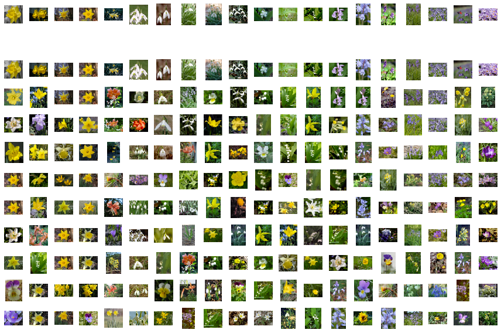

<p align="center">
<a href="https://gnes.ai">
    
</a>
</p>

<p align="center">
<a href="https://cloud.drone.io/gnes-ai/gnes">
    
</a>
<a href="https://pypi.org/project/gnes/">
    
</a>
<a href='https://doc.gnes.ai/'>
    
</a>
<a href="https://www.codacy.com/app/gnes-ai/gnes?utm_source=github.com&amp;utm_medium=referral&amp;utm_content=gnes-ai/gnes&amp;utm_campaign=Badge_Grade">
    
</a>
<a href="https://codecov.io/gh/gnes-ai/gnes">
  
</a>
<a href='https://github.com/gnes-ai/gnes/blob/master/LICENSE'>
    
</a>
</p>

<p align="center">
  <a href="#highlights">Highlights</a> •
  <a href="#overview">Overview</a> •
  <a href="#install-gnes">Install</a> •
  <a href="#getting-started">Getting Started</a> •
  <a href="https://github.com/gnes-ai/hub">Hub</a> •
  <a href="#documentation">Documentation</a> •
  <a href="#tutorial">Tutorial</a> •
  <a href="#contributing">Contributing</a> •
  <a href="./CHANGELOG.md">Release Notes</a> •
  <a href="https://hanxiao.github.io/2019/07/29/Generic-Neural-Elastic-Search-From-bert-as-service-and-Go-Way-Beyond/">Blog</a>  
</p>

<h2 align="center">What is it</h2>

GNES [<i>jee-nes</i>] is **Generic Neural Elastic Search**, a cloud-native semantic search system based on deep neural network. 


GNES enables large-scale index and semantic search for **text-to-text**, **image-to-image**, **video-to-video** and *any-to-any* content form.


<h2 align="center">Highlights</h2>

<p align="center">
  <a href="https://hanxiao.github.io/2019/07/29/Generic-Neural-Elastic-Search-From-bert-as-service-and-Go-Way-Beyond/">💭 To know more about the key tenets of GNES, read this blog post</a>
</p>

<center>
<table>
  <tr>
    <th><h3>☁️</h3><h3>Cloud-Native & Elastic</h3></th>
    <th><h3>🐣</h3><h3>Easy-to-Use</h3></th>
    <th><h3>🔬</h3><h3>State-of-the-Art</h3></th>
  </tr>
  <tr>
    <td width="33%"><sub>GNES is <i>all-in-microservice</i>! Encoder, indexer, preprocessor and router are all running in their own containers. They communicate via versioned APIs and collaborate under the orchestration of Docker Swarm/Kubernetes etc. Scaling, load-balancing, automated recovering, they come off-the-shelf in GNES.</sub></td>
    <td width="33%"><sub>How long would it take to deploy a change that involves just switching a layer in VGG? In GNES, this is just one line change in a YAML file. We abstract the encoding and indexing logic to a YAML config, so that you can change or stack encoders and indexers without even touching the codebase.</sub></td>
    <td width="33%"><sub>Taking advantage of fast-evolving AI/ML/NLP/CV communities, we learn from best-of-breed deep learning models and plug them into GNES, making sure you always enjoy the state-of-the-art performance.</sub></td>
  </tr>
  <tr>
      <th><h3>🌌</h3><h3>Generic & Universal</h3></th>
      <th><h3>📦</h3><h3>Model as Plugin</h3></th>
      <th><h3>💯</h3><h3>Best Practice</h3></th>
    </tr>
    <tr>
      <td width="33%"><sub>Searching for texts, image or even short-videos? Using Python/C/Java/Go/HTTP as the client? Doesn't matter which content form you have or which language do you use, GNES can handle them all. </sub></td>
      <td width="33%"><sub>When built-in models do not meet your requirments, simply build your own with <a href="https://github.com/gnes-ai/hub">GNES Hub</a>. Pack your model as a docker container and use it as a plugin.</sub></td>
      <td width="33%"><sub>We love to learn the best practice from the community, helping our GNES to achieve the next level of availability, resiliency, performance, and durability. If you have any ideas or suggestions, feel free to contribute.</sub></td>
    </tr>
</table>
</center>

<h2 align="center">Overview</h2>
<p align="center">
<a href="https://gnes.ai">

</a>
</p>

### GNES Hub

<center>
<table>
  <tr>
  <td width="33%"><a href="https://github.com/gnes-ai/hub">
      
      </a></td>
  <td>
  <p><a href="https://github.com/gnes-ai/hub">GNES Hub</a> ship AI/ML models as Docker containers and use Docker containers as plugins. It offers a clean and sustainable way to port external algorithms (with the dependencies) into the GNES framework. </p>
  <p>GNES Hub is hosted on the Docker Hub.</p>
</td>
  </tr>
</table>
</center>


<h2 align="center">Install GNES</h2>

There are two ways to get GNES, either as a Docker image or as a PyPi package. **For cloud users, we highly recommend using GNES via Docker**. 

### Run GNES as a Docker Container

```bash
docker run gnes/gnes:latest-alpine
```

This command downloads the latest GNES image (based on [Alpine Linux](https://alpinelinux.org/)) and runs it in a container. When the container runs, it prints an informational message and exits.

#### 💡 Choose the right GNES image

Besides the `alpine` image optimized for the space, we also provide Buster (Debian 10.0), Ubuntu 18.04 and Ubuntu 16.04-based images. The table below summarizes [all available GNES tags](https://cloud.docker.com/u/gnes/repository/docker/gnes/gnes). One can fill in `{ver}` with `latest`, `stable` or `v0..xx`. `latest` refers to the **latest master** of this repository, which [may not be stable](./CONTRIBUTING.md#Merging-Process). We recommend you to use an official release by changing the `latest` to a version number, say `v0.0.24`, or simply using `stable` for the last release, e.g. `gnes:stable-ubuntu`

<table>
  <tr>
    <th>Tag</th>
    <th>Size and layers</th>
    <th>Description</th>
  </tr>
  <tr>
    <td><code>{ver}-alpine</code></td>
    <td><a href="https://microbadger.com/images/gnes/gnes:latest-alpine" title="Get your own image badge on microbadger.com"></a></td>
    <td>based on Alpine Linux;<br>no deep learning libraries;<br>extremely lightweight and portable, enables fast scaling on even edge devices.</td>
  </tr>
  <tr>
    <td><code>{ver}-buster</code></td>
    <td><a href="https://microbadger.com/images/gnes/gnes:latest-buster" title="Get your own image badge on microbadger.com"></a></td>
    <td>based on Debian 10.0;<br>no deep learning libraries;<br>recommended for building or extending a GNES-Hub image.</td>
  </tr>
  <tr>
    <td><code>{ver}-ubuntu18</code></td>
    <td><a href="https://microbadger.com/images/gnes/gnes:latest-ubuntu18" title="Get your own image badge on microbadger.com"></a></td>
    <td>based on Ubuntu 18.04;<br>no deep learning libraries.</td>
  </tr>
  <tr>
    <td><code>{ver}-full</code></td>
    <td><a href="https://microbadger.com/images/gnes/gnes:latest-full" title="Get your own image badge on microbadger.com"></a></td>
    <td>based on Ubuntu 16.04;<br>python-3.6.8, cuda-10.0, tf1.14, pytorch1.1, faiss, multiple pretrained models; <br>heavy but self-contained, useful in testing GNES end-to-endly.</td>
  </tr>
</table>

> ⚠️ Since 2019/10/21, we have stopped hosting the public mirror Tencent Cloud. The old Docker images still exist, but there won't be new images available on Tencent Cloud anymore.

We also provide a public mirror [Github packages](https://github.com/gnes-ai/gnes/packages/). Select the mirror that serves you well.

```bash
docker login --username=xxx docker.pkg.github.com/gnes-ai/gnes  # login to github package so that we can pull from it
docker run docker.pkg.github.com/gnes-ai/gnes/gnes:latest-alpine
```

The table below shows the status of the build pipeline.

<table>
<tr><th>Registry</th><th>Build status</th></tr>
<tr>
<td><sub>Docker Hub</sub><br><code>gnes/gnes:[tag]</code></td>
<td><a href="https://drone.gnes.ai/gnes-ai/gnes"></a></td>
</tr>
<tr>
<td><sub>Github Package</sub><br><code>docker.pkg.github.com/gnes-ai/gnes/gnes:[tag]</code></td>
<td><a href="https://drone.gnes.ai/gnes-ai/gnes"></a></td>
</tr>
</table>

### Install GNES via `pip`

You can also install GNES as a *Python3* package via:
```bash
pip install gnes
```

Note that this will only install a "barebone" version of GNES, consists of **the minimal dependencies** for running GNES. No third-party pretrained models, deep learning/NLP/CV packages will be installed. We make this setup as the default installation behavior, as a model interested to NLP engineers may not be interested to CV engineers. In GNES, models serve as Docker plugins. 

> 🚸 Tensorflow, Pytorch and torchvision are not part of GNES installation. Depending on your model, you may have to install them in advance.

Though not recommended, you can install GNES with full dependencies via:
```bash
pip install gnes[all]
```

<details>
 <summary>🍒 Or cherry-picking the dependencies according to the table below: (click to expand...)</summary>


<table>
<tr><td><pre>pip install gnes[bert]</pre></td><td>bert-serving-server>=1.8.6, bert-serving-client>=1.8.6</td>
<tr><td><pre>pip install gnes[flair]</pre></td><td>flair>=0.4.1</td>
<tr><td><pre>pip install gnes[annoy]</pre></td><td>annoy==1.15.2</td>
<tr><td><pre>pip install gnes[chinese]</pre></td><td>jieba</td>
<tr><td><pre>pip install gnes[vision]</pre></td><td>opencv-python>=4.0.0, imagehash>=4.0</td>
<tr><td><pre>pip install gnes[leveldb]</pre></td><td>plyvel>=1.0.5</td>
<tr><td><pre>pip install gnes[test]</pre></td><td>pylint, memory_profiler>=0.55.0, psutil>=5.6.1, gputil>=1.4.0</td>
<tr><td><pre>pip install gnes[transformers]</pre></td><td>pytorch-transformers</td>
<tr><td><pre>pip install gnes[onnx]</pre></td><td>onnxruntime</td>
<tr><td><pre>pip install gnes[audio]</pre></td><td>librosa>=0.7.0</td>
<tr><td><pre>pip install gnes[scipy]</pre></td><td>scipy</td>
<tr><td><pre>pip install gnes[nlp]</pre></td><td>bert-serving-server>=1.8.6, pytorch-transformers, flair>=0.4.1, bert-serving-client>=1.8.6</td>
<tr><td><pre>pip install gnes[cn_nlp]</pre></td><td>pytorch-transformers, bert-serving-client>=1.8.6, bert-serving-server>=1.8.6, jieba, flair>=0.4.1</td>
<tr><td><pre>pip install gnes[all]</pre></td><td>pylint, psutil>=5.6.1, pytorch-transformers, annoy==1.15.2, bert-serving-client>=1.8.6, gputil>=1.4.0, bert-serving-server>=1.8.6, imagehash>=4.0, onnxruntime, memory_profiler>=0.55.0, jieba, flair>=0.4.1, librosa>=0.7.0, scipy, plyvel>=1.0.5, opencv-python>=4.0.0</td>
</table>
</details> 

A good way to cherry-pick dependencies is following [the example in GNES Hub](https://github.com/gnes-ai/hub#cherry-picking-dependencies-to-enable-gnes-built-in-models) and building you own GNES image.

Either way, if you end up reading the following message after `$ gnes` or `$ docker run gnes/gnes`, then you are ready to go!

<p align="center">
<a href="https://gnes.ai">

</a>
</p>


<h2 align="center">Getting Started</h2>

- [🐣 Preliminaries](#-preliminaries)
  * [Microservice](#microservice)
  * [Workflow](#workflow)
- [Building a flower search engine in 3 minutes](#building-a-flower-search-engine-in-3-minutes)
  * [Define the indexing workflow](#define-the-indexing-workflow)
  * [Indexing flower image data](#indexing-flower-image-data)
  * [Querying similar flowers](#querying-similar-flowers)
- [Elastic made easy](#elastic-made-easy)
- [Deploying a flow via Docker Swarm/Kubernetes](#deploying-a-flow-via-docker-swarmkubernetes)
- [Building a cloud-native semantic poem search engine](#building-a-cloud-native-semantic-poem-search-engine)
- [👨‍💻️Take-home messages](#-take-home-messages)


### 🐣 Preliminaries

Before we start, let me first introduce two important concepts in GNES: **microservice** and **workflow**. 

#### Microservice

For machine learning engineers and data scientists who are not familiar with the concept of *cloud-native* and *microservice*, one can picture a microservice as an app on your smartphone. Each app runs independently, and an app may cooperate with other apps to accomplish a task. In GNES, we have four fundamental apps, aka. microservices, they are:

- [**Preprocessor**](http://doc.gnes.ai/en/latest/chapter/microservice.html#preprocess): transforming a real-world object to a list of workable semantic units;
- [**Encoder**](http://doc.gnes.ai/en/latest/chapter/microservice.html#encode): representing a semantic unit with vector representation;
- [**Indexer**](http://doc.gnes.ai/en/latest/chapter/microservice.html#index): storing the vectors into memory/disk that allows fast-access;
- [**Router**](http://doc.gnes.ai/en/latest/chapter/microservice.html#route): forwarding messages between microservices: e.g. batching, mapping, reducing.

In GNES, we have implemented dozens of preprocessor, encoder, indexer to process different content forms, such as image, text, video. It is also super easy to plug in your own implementation, which we shall see an example in the sequel.

#### Workflow

Now that we have a bunch of apps, what are we expecting them to do? A typical search system has two fundamental tasks: **index** and **query**. Index is storing the documents, query is searching the documents. In a neural search system, one may face another task: **train**, where one fine-tunes an encoder/preprocessor according to the data distribution in order to achieve better search relevance. 

These three tasks correspond to three different **workflows** in GNES.

### Building a flower search engine in 3 minutes

> 📣 Since `v0.0.46` [GNES Flow](http://doc.gnes.ai/en/latest/api/gnes.flow.html) has become the main interface of GNES. GNES Flow provides a **pythonic** and **intuitive** way to implement a **workflow**, enabling users to run or debug GNES on a local machine. By default, GNES Flow orchestrates all microservices using multi-thread or multi-process backend, it can be also exported to a Docker Swarm/Kubernetes YAML config, allowing one to deliver GNES to the cloud.


🔰 The complete example and the corresponding Jupyter Notebook [can be found at here](https://github.com/gnes-ai/demo-gnes-flow).


In this example, we will use the new `gnes.flow` API (`gnes >= 0.0.46` is required) to build a toy image search system for indexing and retrieving [flowers](http://www.robots.ox.ac.uk/~vgg/data/flowers/17/) based on their similarities.

#### Define the indexing workflow

Let's first define the indexing workflow by:

```python
from gnes.flow import Flow
flow = (Flow(check_version=False)
        .add_preprocessor(name='prep', yaml_path='yaml/prep.yml')
        .add_encoder(yaml_path='yaml/incep.yml')
        .add_indexer(name='vec_idx', yaml_path='yaml/vec.yml')
        .add_indexer(name='doc_idx', yaml_path='yaml/doc.yml', recv_from='prep')
        .add_router(name='sync', yaml_path='BaseReduceRouter', num_part=2, recv_from=['vec_idx', 'doc_idx']))
```

Here, we use [the inceptionV4 pretrained model](https://github.com/tensorflow/models/tree/master/research/slim) as the encoder and the built-in indexers for storing vectors and documents. The flow should be quite self-explanatory, if not, you can always convert it to a SVG image and see its visualization:

```python
flow.build(backend=None).to_url()
``` 

<p align="center">
<a href="https://github.com/gnes-ai/demo-poems-ir">

</a>
</p>

#### Indexing flower image data

To index our flower data, we need an iterator that generates `bytes` strings and feed those `bytes` strings into the defined flow.

```python
def read_flowers(sample_rate=1.0):
    with tarfile.open('17flowers.tgz') as fp:
        for m in fp.getmembers():
            if m.name.endswith('.jpg') and random.random() <= sample_rate:
                yield fp.extractfile(m).read()
```

We can now do indexing via the multi-process backend:

```python
with flow(backend='process') as fl:
    fl.index(bytes_gen=read_flowers(), batch_size=64)
```

It will take few minutes depending on your machine.

#### Querying similar flowers

We simply sample 20 flower images as queries and search for their top-10 similar images: 

```python
num_q = 20
topk = 10
sample_rate = 0.05

# do the query
results = []
with flow.build(backend='process') as fl:
    for q, r in fl.query(bytes_gen=read_flowers(sample_rate)):
        q_img = q.search.query.raw_bytes
        r_imgs = [k.doc.raw_bytes for k in r.search.topk_results]
        r_scores = [k.score.value for k in r.search.topk_results]
        results.append((q_img, r_imgs, r_scores))
        if len(results) > num_q:
            break
```

Here is the result, where queries are on the first row.



### Elastic made easy

To increase the number of parallel components in the flow, simply add `replicas` to each service:

```python
flow = (Flow(check_version=False, ctrl_with_ipc=True)
        .add_preprocessor(name='prep', yaml_path='yaml/prep.yml', replicas=5)
        .add_encoder(yaml_path='yaml/incep.yml', replicas=6)
        .add_indexer(name='vec_idx', yaml_path='yaml/vec.yml')
        .add_indexer(name='doc_idx', yaml_path='yaml/doc.yml', recv_from='prep')
        .add_router(name='sync', yaml_path='BaseReduceRouter', num_part=2, recv_from=['vec_idx', 'doc_idx']))
```

```python
flow.build(backend=None).to_url()
```

<p align="center">
<a href="https://github.com/gnes-ai/demo-poems-ir">

</a>
</p>

### Deploying a flow via Docker Swarm/Kubernetes

One can convert a `Flow` object to Docker Swarm/Kubernetes YAML compose file very easily via:
```python
flow.build(backend=None).to_swarm_yaml()
```

```yaml
version: '3.4'
services:
  Frontend0:
    image: gnes/gnes:latest-alpine
    command: frontend --port_in 56086 --port_out 52674 --port_ctrl 49225 --check_version
      False --ctrl_with_ipc True
  prep:
    image: gnes/gnes:latest-alpine
    command: preprocess --port_in 52674 --port_out 65461 --host_in Frontend0 --socket_in
      PULL_CONNECT --socket_out PUB_BIND --port_ctrl 49281 --check_version False --ctrl_with_ipc
      True --yaml_path yaml/prep.yml
  Encoder0:
    image: gnes/gnes:latest-alpine
    command: encode --port_in 65461 --port_out 50488 --host_in prep --socket_in SUB_CONNECT
      --port_ctrl 62298 --check_version False --ctrl_with_ipc True --yaml_path yaml/incep.yml
  vec_idx:
    image: gnes/gnes:latest-alpine
    command: index --port_in 50488 --port_out 57791 --host_in Encoder0 --host_out
      sync --socket_in PULL_CONNECT --socket_out PUSH_CONNECT --port_ctrl 58367 --check_version
      False --ctrl_with_ipc True --yaml_path yaml/vec.yml
  doc_idx:
    image: gnes/gnes:latest-alpine
    command: index --port_in 65461 --port_out 57791 --host_in prep --host_out sync
      --socket_in SUB_CONNECT --socket_out PUSH_CONNECT --port_ctrl 50333 --check_version
      False --ctrl_with_ipc True --yaml_path yaml/doc.yml
  sync:
    image: gnes/gnes:latest-alpine
    command: route --port_in 57791 --port_out 56086 --host_out Frontend0 --socket_out
      PUSH_CONNECT --port_ctrl 51285 --check_version False --ctrl_with_ipc True --yaml_path
      BaseReduceRouter --num_part 2
```


To deploy it, simply copy the generated YAML config to a file say `my-gnes.yml`, and then do

```bash
docker stack deploy --compose-file my-gnes.yml gnes-531
```


### Building a cloud-native semantic poem search engine

In this example, we will build a semantic poem search engine using GNES. Unlike the previous flower search example, here we run each service as an isolated Docker container and then orchestrate them via Docker Swarm. It represents a common scenario in the cloud settings. You will learn how to use powerful and customized GNES images from [GNES hub](https://github.com/gnes-ai/hub).

🔰 Please checkout [this repository for details](https://github.com/gnes-ai/demo-poems-ir) and follow the instructions to reproduce.

<p align="center">
<a href="https://github.com/gnes-ai/demo-poems-ir">

</a>
</p>


### 👨‍💻️ Take-home messages

Let's make a short recap of what we have learned. 

- GNES is *all-in-microservice*, there are four fundamental components: preprocessor, encoder, indexer and router.
- GNES has three typical workflows: train, index, and query.
- One can leverage [GNES Flow API](http://doc.gnes.ai/en/latest/api/gnes.flow.html) to define, modify, export or even visualize a workflow.
- GNES requires an orchestration engine to coordinate all microservices. It supports Kubernetes, Docker Swarm,  or built-in multi-process/thread solution. 


<h2 align="center">Documentation</h2>

[](https://doc.gnes.ai)

The official documentation of GNES is hosted on [doc.gnes.ai](https://doc.gnes.ai/). It is automatically built, updated and archived on every new release.

<h2 align="center">Tutorial</h2>

> 🚧 Tutorial is still under construction. Stay tuned! Meanwhile, we sincerely welcome you to contribute your own learning experience / case study with GNES! 

- [How to write your GNES YAML config](tutorials/gnes-compose-yaml-spec.md)
- [How to write a component-wise YAML config](tutorials/component-yaml-spec.md)
- [Model management with GNES Hub](https://github.com/gnes-ai/hub#tutorial)
    * [Porting `PyTorch-Transformers` into GNES](https://github.com/gnes-ai/hub#porting-pytorch-transformers-into-gnes)
    * [Porting multiple modules in a row](https://github.com/gnes-ai/hub#porting-multiple-modules-in-a-row)
    * [Cherry-picking dependencies and build your own GNES](https://github.com/gnes-ai/hub#cherry-picking-dependencies-to-enable-gnes-built-in-models)
- [Understanding preprocessor, encoder, indexer and router](https://hanxiao.github.io/2019/07/29/Generic-Neural-Elastic-Search-From-bert-as-service-and-Go-Way-Beyond/#gnes-preliminaries-breakdown-of-neural-elastic-and-search)
- Index and query text data with GNES
- Index and query image data with GNES
- Index and query video data with GNES
- Using GNES with Kubernetes
- Using GNES in other language (besides Python)
- Serves HTTP-request with GNES in an end-to-end way
- Migrating from [`bert-as-service`](https://github.com/hanxiao/bert-as-service)

<h2 align="center">Benchmark</h2>

We have setup [this repository](https://github.com/gnes-ai/benchmark) to track the network latency over different GNES versions. As a part of CICD pipeline, this repo gets automatically updated when the [GNES master](https://github.com/gnes-ai/gnes) is updated or a new [GNES version is released](https://github.com/gnes-ai/gnes/releases).


<h2 align="center">Contributing</h2>

❤️ The beginning is always the hardest. But fear not, even if you find a typo, a missing docstring or unit test, you can simply correct them by making a commit to GNES. Here are the steps:

1. Create a new branch, say `fix-gnes-typo-1`
2. Fix/improve the codebase
3. Commit the changes. Note the **commit message must follow [the naming style](./CONTRIBUTING.md#commit-message-naming)**, say `fix(readme): improve the readability and move sections`
4. Make a pull request. Note the **pull request must follow [the naming style](./CONTRIBUTING.md#commit-message-naming)**. It can simply be one of your commit messages, just copy paste it, e.g. `fix(readme): improve the readability and move sections`
5. Submit your pull request and wait for all checks passed (usually 10 minutes)
    - Coding style
    - Commit and PR styles check
    - All unit tests
6. Request reviews from one of the developers from our core team.
7. Get a LGTM 👍 and PR gets merged.

Well done! Once a PR gets merged, here are the things happened next:
- all Docker images tagged with `-latest` will be automatically updated in an hour. You may check the [its building status at here](https://github.com/gnes-ai/gnes/#install-gnes-via-pip)
- on every Friday when a new release is published, PyPi packages and all Docker images tagged with `-stable` will be updated accordindly. 
- your contribution and commits will be included in [our weekly release note](https://github.com/gnes-ai/gnes/blob/master/CHANGELOG.md). 🍻

More details can be found in the [contributor guidelines](./CONTRIBUTING.md).

<h2 align="center">Citing GNES</h2>

If you use GNES in an academic paper, you are more than welcome to make a citation. Here are the two ways of citing GNES:

1.     \footnote{https://github.com/gnes-ai/gnes}
2. 
    ```latex
    @misc{tencent2019GNES,
      title={GNES: Generic Neural Elastic Search},
      author={Xiao, Han and Yan, Jianfeng and Wang, Feng and Fu, Jie and Liu, Kai},
      howpublished={\url{https://github.com/gnes-ai}},
      year={2019}
    }
    ```

<h2 align="center">License</h2>

If you have downloaded a copy of the GNES binary or source code, please note that the GNES binary and source code are both licensed under the [Apache License, Version 2.0](./LICENSE).

<sub>
Tencent is pleased to support the open source community by making GNES available.<br>
Copyright (C) 2019 THL A29 Limited, a Tencent company. All rights reserved.
</sub>
