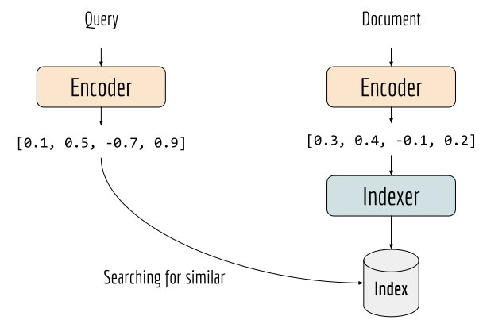
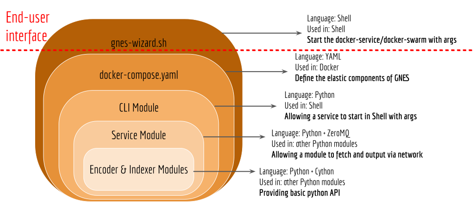
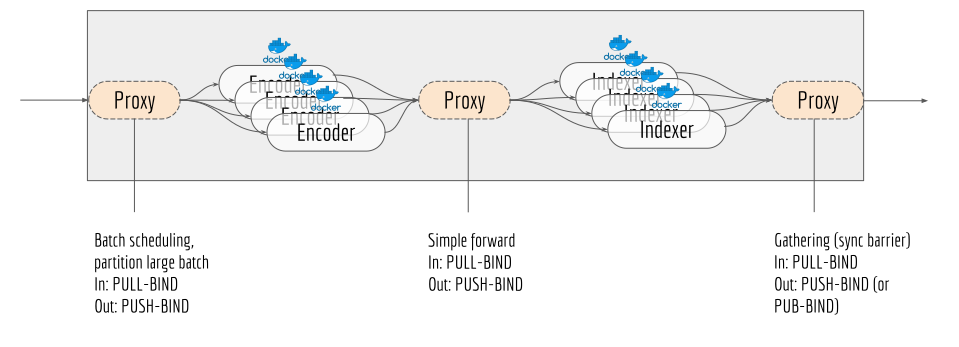

# GNES Overview

This document explains the design principle of GNES.

GNES is the abbreviation of generic neural elastic search. From its name, one can immediately notice three features of this system:

- Neural network powered. Unlike traditional search system that relies on symbolic representations or handcrafted features, GNES leverages state-of-the-art deep neural network to represent a document.
- Elastic architecture. The overall architecture of GNES is scalable and elastic wrt. the amount of documents. Too many documents to handle? Adding more machines. Few search requests at night? Shutting down some machines. Changing the number of machines does not affect how system works.
- Generic type. GNES is able to handle different types of documents including text, image and video.


## Core Components: Encoder and Indexer

This chapter introduces you the two core components of GNES: the encoder and the indexer. 

Let's start with the essential problem in search. We have a set of document and a given query, the goal is to find documents that are semantically similar to the query. To make this problem more "modern", we restrict ourselves to use deep neural networks in the solution.

For example, if documents are pure text, then a simple LSTM could do the work: we feed the text sequence to an LSTM and take the last state of it to represent the text sequence. The representation is basically a float vector, e.g. 128-/256-dimensional. Now we repeat the procedure on the query and obtain its float-vector representation. The final step is compute the query representation against all documents in pairwise manner and find those similar ones.

If documents are images, then we could use a CNN with extra pooling layers to get the fixed-length representation of an image. The remaining steps are quite similar. So regardless the type of the documents, we always need an **encoder** to represent document into a fixed-length vector representation.

So what is an "indexer"? In the procedure above, I hide the complexity of comparing representations. In fact, when the number of documents is huge, computing the similarity between the query and all documents could take forever. Therefore, we often need a smarter data structure or preprocessing step to speedup this procedure. This smart data structure or preprocessing step is handled by the **indexer**.

The next figure illustrates this idea.



## Encoder and Indexer as Microservices

In GNES, the encoder and the indexer are more than simple Python modules. They are wrapped with network interfaces and command line interfaces, allowing them to be started as a standalone application. They can take input from the network or the output of other microservices.

The next figure illustrates this idea.



One of the immediate advantages of such design is the scalability: you can manage each application/microservice in a container. You can easily make replicas or terminate containers. Containerizing the encoder and the indexer is an important step to realize the elastic nature of GNES, but that's not enough. Let's say you have 4 encoders and 3 indexers running in their own containers. How can these seven containers communicate with each other? Where should the encoder send the resulting vector to? How do microservices know about each other?


## Message Forwarding via Proxy

A proxy is designed to forward messages. It is the static point in the elastic architecture. There are different types of forwarding: simple forwarding, broadcasting, map-reduce style forwarding. By adding a proxy that all encoders and indexers connected, every encoder can simply send its result to the proxy without worrying about the number of indexers. As for the indexers, they just read from the proxy without knowing which encoder writes the message. Consequently, it becomes trivial to add more encoders or indexers. 
 
Note, the proxy is also wrapped with command line interfaces so that it can be started as a standalone application.

The next figure illustrates the GNES architecture at the indexing time.



There are three proxies in the architecture above. For the end-user, only the income port of the left-most proxy and the output port of the right-most proxy matters. These two ports are exposed from the GNES system (as illustrated in grey box) facing the end-user. One can add as many encoders and indexers as possible, but there will always be three proxies.


## Putting Everything Together

GNES relies on the Docker Swarm for managing, scaling and conducting orchestration tasks over multiple micro-services.

```yaml
version: '3.4'
services:
  income-proxy:
    image: ${DOCKER_IMG_URL}
    command: >
      proxy --proxy_type MapProxyService --port_in ${INCOME_PROXY_IN} --port_out ${INCOME_PROXY_OUT}
      --socket_in PULL_BIND --socket_out PUSH_BIND --batch_size=128
    networks:
      gnes-net:
        aliases:
          - income_proxy
    ports:
      - ${HOST_PORT_IN}:${INCOME_PROXY_IN}

  middleman-proxy:
    image: ${DOCKER_IMG_URL}
    command: >
      proxy --proxy_type=ProxyService --port_in ${MIDDLEMAN_PROXY_IN} --port_out ${MIDDLEMAN_PROXY_OUT}
      --socket_in PULL_BIND --socket_out PUSH_BIND
      --unk_msg_route DEFAULT
    networks:
      gnes-net:
        aliases:
          - middleman_proxy

  outgoing-proxy:
    image: ${DOCKER_IMG_URL}
    command: >
      proxy --proxy_type=ProxyService --port_in ${OUTGOING_PROXY_IN} --port_out ${OUTGOING_PROXY_OUT}
      --socket_in PULL_BIND --socket_out PUB_BIND
      --unk_msg_route DEFAULT
    networks:
      gnes-net:
        aliases:
          - outgoing_proxy
    ports:
      - ${HOST_PORT_OUT}:${OUTGOING_PROXY_OUT}

  encoder:
    image: ${DOCKER_IMG_URL}
    command: >
      encode --port_in ${INCOME_PROXY_OUT} --port_out ${MIDDLEMAN_PROXY_IN}
      --socket_in PULL_CONNECT --socket_out PUSH_CONNECT
      --host_in income-proxy --host_out middleman-proxy
      --mode INDEX --yaml_path /encoder_config --dump_path /dump/model.bin
    volumes:
      - "${MODEL_DIR}:/ext_data"
      - "${OUTPUT_DIR}:/dump"
    networks:
      gnes-net:
        aliases:
          - encoder_serviced
    deploy:
      replicas: 1
      restart_policy:
        condition: on-failure
        max_attempts: 3

    depends_on:
      - income-proxy
      - middleman-proxy

    configs:
      - encoder_config

  indexer:
    image: ${DOCKER_IMG_URL}
    command: >
      index --port_in ${MIDDLEMAN_PROXY_OUT} --port_out ${OUTGOING_PROXY_IN}
       --socket_in PULL_CONNECT --socket_out PUSH_CONNECT
       --host_in middleman-proxy --host_out outgoing-proxy
       --mode INDEX --yaml_path /indexer_config --dump_path /out_data/index.bin
    volumes:
      - index_data:/out_data
      #- type: volume
      #  source: "index_data"
      #  target: "/out_data"

      #- "${OUTPUT_DIR}/indexer_dump.{{.Task.Slot}}:/out_data"

    deploy:
      replicas: 3
      restart_policy:
        condition: on-failure
        max_attempts: 3

    environment:
      - NODE_ID={{.Node.ID}}
      - SERVICE_ID={{.Service.ID}}
      - SERVICE_NAME={{.Service.Name}}
      - SERVICE_LABELS={{.Service.Labels}}
      - TASK_ID={{.Task.ID}}
      - TASK_NAME={{.Task.Name}}
      - TASK_SLOT={{.Task.Slot}}

    networks:
      gnes-net:
        aliases:
          - index_serviced
    depends_on:
      - middleman-proxy
      - outgoing-proxy

    configs:
      - indexer_config

volumes:
  index_data:
    name: "${GNES_STACK_NAME}_shard_{{ .Task.Slot }}_data"

networks:
  gnes-net:
    driver: overlay
    attachable: true

configs:
  encoder_config:
    file: "${ENCODER_YAML_PATH}"
  indexer_config:
    file: "${INDEXER_YAML_PATH}"
```
