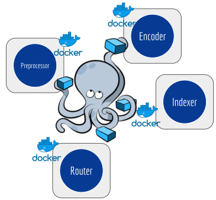

Microservices
=============

GNES is all-in-microservice: encoder, indexer, preprocessor and router are all running statelessly and independently in their own containers. They communicate via versioned APIs and collaborate under the orchestration of Docker Swarm/Kubernetes etc. Scaling, load-balancing, automated recovering, they come off-the-shelf in GNES.

|

.. argparse::
   :ref: gnes.cli.parser.get_main_parser
   :prog: gnes