# How to write your first GNES YAML config

YAML is everywhere. This is pretty much your impression when first trying GNES. Understanding the YAML config is therefore extremely important to use GNES.

Essentially, GNES only requires two types of YAML config:
- GNES-compose YAML
- Component-wise YAML

All other YAML files, including the docker-compose YAML config and Kubernetes config generated from the [GNES Board](https://board.gnes.ai) or `$ gnes compose` command are not a part of this tutorial. Interested readers are welcome to read their [YAML specification](https://docs.docker.com/compose/compose-file/) respectively.

## GNES-compose YAML

The GNES-compose YAML defines a high-level service topology behind the GNES app. It is designed for simplicity and clarity, allowing the user to quickly get started with GNES. 

The code below shows a example GNES-compose YAML:

```yaml
port: 5566
services:
- name: Preprocessor
  yaml_path: text-prep.yml
- name: Encoder
  yaml_path: gpt2.yml
- name: Indexer
  yaml_path: b-indexer.yml
```

In this example, our GNES app is composed of three microservices: `Preprocessor`,
`Encoder` and `Indexer` as a pipeline. Each component is associated with a component-wise YAML file by `yaml_path`. All accepted arguments are listed below.

|Argument| Type | Description|
|---|---|---|
| `name` | str | the name of this GNES composition, default `GNES app` |
| `port` | int | the communication port with gRPCFrontend, where the GNES app use for sending/receiving message to/from outside, default `8800`|
| `services`| (nested) list | the list of components, see [below for details](#the-service-specification) |
| `volumes` | map/dict | volume mapping used in Docker-Compose/Swarm mode, default `{}` |
| `networks`| map/dict | network mapping used in Docker-Compose/Swarm mode, default `{gnes-net: {driver: overlay, attachable: true}}` |


### The service specification

For each service defined in `services`, it accepts the following arguments.

|Argument| Type | Description|
|---|---|---|
| `name` | str | choose from `[Preprocessor, Encoder, Indexer]` |
| `yaml_path`| str | the absolute/relative path of the component-wise YAML config, default `None` |
| `replicas` | int | the number of replica services you want to start, default `1` |
| `income` | str | choose from `[pull, sub]`. Only applicable when `replicas>1`, where `pull` means competing for the income data and only one replica read the data; `sub` is like a broadcast, all replicas receive the same data, default `pull` |

#### Sequential and parallel services

When specifying `services`, please kindly note the difference between a list and a nested list:

<table>
<tr>
<th>Sequential</th><th>Parallel</th>
</tr>
<tr>
<td>
   <pre lang="yaml">
services:
- name: Preprocessor
  yaml_path: text-prep.yml
- name: Encoder
  yaml_path: gpt2.yml
- name: Indexer
  yaml_path: faiss-indexer.yml
- name: Indexer
  yaml_path: fulltext-indexer.yml
   </pre>
</td>
<td>
<pre lang="yaml">
services:
- name: Preprocessor
  yaml_path: text-prep.yml
- name: Encoder
  yaml_path: gpt2.yml
- 
  - name: Indexer
    yaml_path: faiss-indexer.yml
  - name: Indexer
    yaml_path: fulltext-indexer.yml
</pre>
</td>
</tr>
<tr>
<td>
<a href="https://gnes.ai">
  
  </a>
</td>
<td>
<a href="https://gnes.ai">
  
  </a>
</td>
</tr>
</table>


