# How to write a component-wise YAML config

YAML is everywhere. This is pretty much your impression when first trying GNES. Understanding the YAML config is therefore extremely important to use GNES.

Essentially, GNES requires two types of YAML config:
- [GNES-compose YAML](gnes-compose-yaml-spec.md)
- Component-wise YAML

<p align="center">
<a href="https://gnes.ai">
    
</a>
</p>


All other YAML files, including the docker-compose YAML config and Kubernetes config generated from the [GNES Board](https://board.gnes.ai) or `gnes compose` command are not a part of this tutorial. Interested readers are welcome to read their [YAML specification](https://docs.docker.com/compose/compose-file/) respectively.


## Table of Content

* [Component-wise YAML specification](#component-wise-yaml-specification)
* [`!CLS` specification](#--cls--specification)
* [`parameters` specification](#-parameters--specification)
  - [Use `args` and `kwargs` to simplify the constructor](#use--args--and--kwargs--to-simplify-the-constructor)
* [`gnes_config` specification](#-gnes-config--specification)
* [Every component can be described with YAML in GNES](#every-component-can-be-described-with-yaml-in-gnes)
* [Stack multiple encoders into a `PipelineEncoder`](#stack-multiple-encoders-into-a--pipelineencoder-)
* [What's Next?](#what-s-next-)


## Component-wise YAML specification

Preprocessor, encoder, indexer and router are fundamental components of GNES. They share the same YAML specification. The component-wise YAML defines how a component behaves. On the highest level, it contains three field:

|Argument| Type | Description|
|---|---|---|
| `!CLS` | str | choose from all class names registered in GNES |
| `parameters` | map/dict | a list of key-value pairs that `CLS.__init__()` accepts|
| `gnes_config`| map/dict | a list of key-value pairs for GNES |

Let's take a look an example:

```yaml
!TorchvisionEncoder
parameters:
  model_dir: ${VGG_MODEL}
  model_name: vgg16
  layers:
    - features
    - avgpool
    - x.view(x.size(0), -1)
    - classifier[0]
gnes_config:
  is_trained: true
  name: my-awesome-vgg
```

In this example, we define a `TorchvisionEncoder` that loads a pretrained VGG16 model from the path`${VGG_MODEL}`. We then label this component as trained via `is_trained: true` and set its name to `my-awesome-vgg`.

## `!CLS` specification

`!CLS` is a name tag choosed from all class names registered in GNES. Currently, the following names are available:

|`!CLS`| Component Type |
|---|---|
|`!BasePreprocessor`|Preprocessor|
|`!SentSplitPreprocessor`|Preprocessor|
|`!BaseImagePreprocessor`|Preprocessor|
|`!BaseTextPreprocessor`|Preprocessor|
|`!VanillaSlidingPreprocessor`|Preprocessor|
|`!WeightedSlidingPreprocessor`|Preprocessor|
|`!SegmentPreprocessor`|Preprocessor|
|`!UnaryPreprocessor`|Preprocessor|
|`!BaseVideoPreprocessor`|Preprocessor|
|`!FFmpegPreprocessor`|Preprocessor|
|`!ShotDetectPreprocessor`|Preprocessor|
|`!BertEncoder`|Encoder|
|`!BertEncoderWithServer`|Encoder|
|`!BertEncoderServer`|Encoder|
|`!ElmoEncoder`|Encoder|
|`!FlairEncoder`|Encoder|
|`!GPTEncoder`|Encoder|
|`!GPT2Encoder`|Encoder|
|`!PCALocalEncoder`|Encoder|
|`!PQEncoder`|Encoder|
|`!TFPQEncoder`|Encoder|
|`!Word2VecEncoder`|Encoder|
|`!BaseEncoder`|Encoder|
|`!BaseBinaryEncoder`|Encoder|
|`!BaseTextEncoder`|Encoder|
|`!BaseNumericEncoder`|Encoder|
|`!CompositionalEncoder`|Encoder|
|`!PipelineEncoder`|Encoder|
|`!HashEncoder`|Encoder|
|`!TorchvisionEncoder`|Encoder|
|`!TFInceptionEncoder`|Encoder|
|`!CVAEEncoder`|Encoder|
|`!FaissIndexer`|Indexer|
|`!LVDBIndexer`|Indexer|
|`!AsyncLVDBIndexer`|Indexer|
|`!NumpyIndexer`|Indexer|
|`!BIndexer`|Indexer|
|`!HBIndexer`|Indexer|
|`!JointIndexer`|Indexer|
|`!BaseIndexer`|Indexer|
|`!BaseTextIndexer`|Indexer|
|`!AnnoyIndexer`|Indexer|
|`!BaseRouter`|Router|
|`!BaseMapRouter`|Router|
|`!BaseReduceRouter`|Router|
|`!ChunkToDocRouter`|Router|
|`!DocFillRouter`|Router|
|`!ConcatEmbedRouter`|Router|
|`!PublishRouter`|Router|
|`!DocBatchRouter`|Router|

## `parameters` specification

The key-value pair defined in `parameters` is basically a map of the arguments defined in the constructor of `!CLS`. Let's look at the signature of the constructor `TorchvisionEncoder` as an example:

<table>
<tr>
<th>__init__()</th><th>YAML config</th>
</tr>
<tr>
<td>
   <pre lang="python">
def __init__(self, model_name: str,
                 layers: List[str],
                 model_dir: str,
                 batch_size: int = 64,
                 *args, **kwargs):
  # do model init...
  # ...
   </pre>
</td>
<td>
<pre lang="yaml">
!TorchvisionEncoder
parameters:
  model_dir: ${VGG_MODEL}
  model_name: vgg16
  layers:
    - features
    - avgpool
    - x.view(x.size(0), -1)
    - classifier[0]
</pre>
</td>
</tr>
</table>

Note, if an argument is defined in the `__init__()` but not in YAML, the default value will be used, see `batch_size` and `use_cuda` as examples.

#### Use `args` and `kwargs` to simplify the constructor

When you port an external package/module to GNES, sometimes the original implementation contains too many arguments. It doesn't make sense to write a super long `__init__` as:

```python
def __init__(self, arg1, arg2, arg3, arg4, arg5, ...):
    self.arg1 = arg1
    ext_module.cool_model(arg2, arg3, arg4, arg5, ...)
```

We provide a convenient way for this. Let's see `BertEncoder` as an example, which invokes `BertClient` from the [`bert-as-service`](https://github.com/hanxiao/bert-as-service/) module. In this case, `BertClient` accepts 10 arguments.

<table>
<tr>
<th>__init__()</th><th>YAML config</th>
</tr>
<tr>
<td>
   <pre lang="python">
class BertEncoder(BaseTextEncoder):
    store_args_kwargs = True
    def __init__(self, *args, **kwargs):
        super().__init__(*args, **kwargs)
        self.bert_client = BertClient(*args, **kwargs)
   </pre>
</td>
<td>
<pre lang="yaml">
!BertEncoder
parameters:
  kwargs:
    port: $BERT_CI_PORT
    port_out: $BERT_CI_PORT_OUT
    ignore_all_checks: true
gnes_config:
  is_trained: true
</pre>
</td>
</tr>
</table>

Note that how we defines a map under `kwargs` to describe the arguments, they will be forwarded to the constructor of `BertClient`. Similarly, one can also define a list under `args` to represent unnamed arguments.

## `gnes_config` specification

`gnes_config` defines some meta-information of this component. It accepts the following arguments

|Argument| Type | Description|
|---|---|---|
| `name` | str | the name of the component, default `None` |
| `is_trained` | bool | choose from `[True, False]` represents whether the model has been trained |
| `batch_size` | int | a number defines the batch size, often used in `encode()`, `train()` and `index()`, default `None` meaning doing everything in one shot|
| `work_dir`| str | the working directory of this component, default `$GNES_VOLUME` or the current directory |

`name` is important, as it along with `work_dir` determine the io path of serializing and deserializing the component. If you start a component without a name, it will be assigned to a random name with its class name as the prefix.

## Every component can be described with YAML in GNES

The examples above are all about encoder. In fact, every component including encoder, preprocessor, router, indexer can all be described with YAML and loaded to GNES. For example,

```yaml
!SentSplitPreprocessor
parameters:
  start_doc_id: 0
  random_doc_id: True
  deliminator: "[.。！？!?]+"
gnes_config:
  is_trained: true
```

Sometime it could be quite simple, e.g. 

```yaml
!PublishRouter
parameters:
  num_part: 2
```

Or even a one-liner, e.g.

```yaml
!ConcatEmbedRouter {}
```

You can find a lot of examples in the [unittest](../tests/yaml)

## Stack multiple encoders into a `PipelineEncoder`  

For many real-world applications, a single encoder is often not enough. For example, the output of a `BertEncoder` is 768-dimensional. One may want to append it with some dimensional reduction or quantization models. Of course one can spawn every encoder as an independent container and then connect them together via GNES Board/`gnes compose`. But if you don't need them to be elastic, why bother? This is where `PipelineEncoder` can be very useful: it stacks multiple `BaseEncoder` together, simplifying data-flow in all runtimes (i.e. training, indexing and querying).

#### PipelineEncoder in the training runtime

<p align="center">
<a href="https://gnes.ai">
    
</a>
</p>


#### PipelineEncoder in the indexing and querying runtimes


<p align="center">
<a href="https://gnes.ai">
    
</a>
</p>


To define a `PipelineEncoder`, you just need to sort the encoders in the right order and put them in a list under the `component` field. Let's look at the following example:

```yaml
!PipelineEncoder
components:
  - !TorchvisionEncoder
    parameters:
      model_dir: /ext_data/image_encoder
      model_name: resnet50
      layers:
        - conv1
        - bn1
        - relu
        - maxpool
        - layer1
        - layer2
        - layer3
        - layer4
        - avgpool
        - x.reshape(x.size(0), -1)
    gnes_config:
      is_trained: true
  - !PCALocalEncoder
    parameters:
      output_dim: 200
      num_locals: 10
    gnes_config:
      batch_size: 2048
  - !PQEncoder
    parameters:
      cluster_per_byte: 20
      num_bytes: 10
gnes_config:
  name: my-pipeline
``` 

Note how `gnes_config` is defined for each component and also globally at the very end.

## What's Next?

Now that you have learned how to config a complete GNES app, it is time to run GNES in Shell/Docker/Docker Swarm/Kubernetes!
