# How to write your first GNES YAML config

YAML is everywhere. This is pretty much your impression when first trying GNES. Understanding the YAML config is therefore extremely important to use GNES.

Essentially, GNES requires two types of YAML config:
- GNES-compose YAML
- [Component-wise YAML](component-yaml-spec.md)

<p align="center">
<a href="https://gnes.ai">
    
</a>
</p>


All other YAML files, including the docker-compose YAML config and Kubernetes config generated from the [GNES Board](https://board.gnes.ai) or `gnes compose` command are not a part of this tutorial. Interested readers are welcome to read their [YAML specification](https://docs.docker.com/compose/compose-file/) respectively.

## Table of Content


* [GNES-compose YAML specification](#gnes-compose-yaml-specification)
+ [`services` specification](#-services--specification)
+ [Sequential and parallel services](#sequential-and-parallel-services)
* [`gRPCFrontend` and `Router`, why are they in my graph?](#-grpcfrontend--and--router---why-are-they-in-my-graph-)
* [What's Next?](#what-s-next-)


## GNES-compose YAML specification

The GNES-compose YAML defines a high-level service topology behind the GNES app. It is designed for simplicity and clarity, allowing the user to quickly get started with GNES. 

The code below shows a example GNES-compose YAML:

```yaml
port: 5566
services:
- name: Preprocessor
  yaml_path: text-prep.yml
- name: Encoder
  yaml_path: gpt2.yml
- name: Indexer
  yaml_path: b-indexer.yml
```

In this example, our GNES app is composed of three microservices: `Preprocessor`,
`Encoder` and `Indexer` as a pipeline. Each component is associated with a component-wise YAML file by `yaml_path`. All accepted arguments are listed below.

|Argument| Type | Description|
|---|---|---|
| `name` | str | the name of this GNES composition, default `GNES app` |
| `port` | int | the communication port with gRPCFrontend, where the GNES app use for sending/receiving message to/from outside, default `8800`|
| `services`| (nested) list | the list of components, see [below for details](#the-service-specification) |
| `volumes` | map/dict | volume mapping used in Docker-Compose/Swarm mode, default `{}` |
| `networks`| map/dict | network mapping used in Docker-Compose/Swarm mode, default `{gnes-net: {driver: overlay, attachable: true}}` |


### `services` specification

For each service defined in `services`, it accepts the following arguments.

|Argument| Type | Description|
|---|---|---|
| `name` | str | choose from `[Preprocessor, Encoder, Indexer]` |
| `yaml_path`| str | the absolute/relative path of the component-wise YAML config, default `None` |
| `replicas` | int | the number of replica services you want to start, default `1` |
| `income` | str | choose from `[pull, sub]`. Only applicable when `replicas>1`, where `pull` means competing for the income data and only one replica read the data; `sub` is like a broadcast, all replicas receive the same data, default `pull` |

### Sequential and parallel services

When specifying `services`, please kindly note the difference between a list and a nested list:

<table>
<tr>
<th>Sequential</th><th>Parallel</th>
</tr>
<tr>
<td width="50%">
   <pre lang="yaml">
services:
- name: Preprocessor
  yaml_path: text-prep.yml
- name: Encoder
  yaml_path: gpt2.yml
- name: Indexer
  yaml_path: faiss-indexer.yml
- name: Indexer
  yaml_path: fulltext-indexer.yml
   </pre>
</td>
<td width="50%">
<pre lang="yaml">
services:
- name: Preprocessor
  yaml_path: text-prep.yml
- name: Encoder
  yaml_path: gpt2.yml
- 
  - name: Indexer
    yaml_path: faiss-indexer.yml
  - name: Indexer
    yaml_path: fulltext-indexer.yml
</pre>
</td>
</tr>
<tr>
<td width="50%">
<a href="https://gnes.ai">
  
  </a>
</td>
<td width="50%">
<a href="https://gnes.ai">
  
  </a>
</td>
</tr>
</table>

In the parallel mode, two heterogeneous indexers receive the incoming data from the last encoder in a simultaneous manner. This is particular useful when you have multiple heterogeneous models (e.g. VGG and inception, or Faiss indexer and key-value database), you don't want to wait for one after another as their executions are essentially independent.      

You may also scale up the parallel mode by setting `replicas`, e.g.

```yaml
services:
- name: Preprocessor
  yaml_path: text-prep.yml
- name: Encoder
  yaml_path: gpt2.yml
- 
  - name: Indexer
    yaml_path: faiss-indexer.yml
    replicas: 2
  - name: Indexer
    yaml_path: fulltext-indexer.yml
    replicas: 3
```

which results a topology like the following:

<p align="center">
<a href="https://gnes.ai">
    
</a>
</p>

## `gRPCFrontend` and `Router`, why are they in my graph?

Careful readers may notice that `gRPCFrontend` and `Router` components may be added to the workflow graph, even though they are not defined in the YAML file. Here is the explanation:

- `gRPCFrontend` serves as **the only interface** between GNES and the outside. All data must be sent to it and all results will be returned from it, which likes a hole on the black-box. Its data-flow pattern and the role it's playing in GNES is *so deterministic* that we don't even want to bother users to define it.
- Put simply, `Router` forwards messages. It is often required when `replicas` > 1. However, the behavior of a router depends on the topology and the runtime (i.e. training, indexing and querying). Sometimes it serves as a mapper, other times it serves as a reducer or an aggregator, or even not required. In general, it might not be very straightforward for beginners to choose the right router. Fortunately, the type of the router can often be determined by the two consecutive layers, which is exactly what GNES Board (`gnes compose`) does.

## What's Next?

The GNES-compose YAML describes a high-level picture of the GNES topology. Having it only is not enough. The detailed specification of each component is defined in `yaml_path` respectively, namely the *component-wise YAML config*. In the next tutorial, you will learn how to write a component-wise YAML config.
